<div align="center">

<a href="https://drogoz.network"></a>

<br/>

<a href="https://drogoz.network"></a>
<a href="https://t.me/drogoz"></a>
<a href="mailto:hello@drogoz.network"></a>
<a href="https://drogoz.network"></a>


</div>

<br/>


<div align="center">

## Drogoz — founder of <a href="https://drogoz.network">Drogoz Network</a> &amp; <a href="https://hashgram.io">Hashgram</a>

</div>

Specialist in **cryptography**, **cybersecurity**, **quantum computing**, **backend engineering** and **blockchain** — and the founder of **Drogoz Network**, a Premium SaaS Network where premium software is rented monthly with transparent pricing, a dedicated manager and support that stays with you.

Drogoz Network runs **15 live products** — from an unmetered AI workspace for developers and real-time face transformation, to a non-custodial crypto exchange, real-time crypto payment infrastructure, an outbound dialer that protects your numbers, enterprise email marketing, lead delivery, contact verification, endpoint management, Ethereum tooling, an always-free open-source task control center and an auditable cryptocurrency accounting platform for finance teams — with two more on the way. Every product can be seen live, for free, before you pay.

<div align="center">

<br/>

   

<br/><br/>

<table>
<tr>
<td align="center" width="33%"><b>01 · Reliable &amp; secure</b><br/><sub>Guarded access and infrastructure that holds — on every service you run.</sub></td>
<td align="center" width="33%"><b>02 · Dedicated managers</b><br/><sub>Your own dedicated team, and a direct line of support — not a ticket queue.</sub></td>
<td align="center" width="33%"><b>03 · Transparent pricing</b><br/><sub>Your exact monthly cost, in seconds. No quotes. Nothing hidden.</sub></td>
</tr>
</table>

</div>


## 🗂️ Services

<div align="center"><sub>Pick a product and pay only for what you need — every service has its own repository with a full product README.</sub></div>

<br/>

<table>
<tr>
<td align="center" valign="top" width="33%">
<a href="https://github.com/deepdrogo/drog-ai"></a><br/><br/>
<a href="https://github.com/deepdrogo/drog-ai"><b>Drog AI</b></a><br/>
<sub>An AI workspace for professional developers — no token budget, no message caps, no throttling.</sub><br/><br/>
 <br/><br/>
<sub><a href="https://drog.ai/">Website</a> · <a href="https://drogoz.network/services/drogai/">Details</a> · <a href="https://t.me/drog_ai">Telegram</a> · <a href="https://github.com/deepdrogo/drog-ai">Repo</a></sub>
</td>
<td align="center" valign="top" width="33%">
<a href="https://github.com/deepdrogo/mymask-ai"></a><br/><br/>
<a href="https://github.com/deepdrogo/mymask-ai"><b>MyMask AI</b></a><br/>
<sub>Real-time, CUDA-accelerated AI face swapping for professional video calls.</sub><br/><br/>
 <br/><br/>
<sub><a href="https://mymask.pro/">Website</a> · <a href="https://drogoz.network/services/MyMask/">Details</a> · <a href="https://t.me/mymask_ai">Telegram</a> · <a href="https://github.com/deepdrogo/mymask-ai">Repo</a></sub>
</td>
<td align="center" valign="top" width="33%">
<a href="https://github.com/deepdrogo/replika"></a><br/><br/>
<a href="https://github.com/deepdrogo/replika"><b>Replika</b></a><br/>
<sub>Precision simulation platform with Windows, Chrome and manager builds, controlled from one panel.</sub><br/><br/>
 <br/><br/>
<sub><a href="https://replika.software/">Website</a> · <a href="https://drogoz.network/services/replika/">Details</a> · <a href="https://t.me/replika_pro">Telegram</a> · <a href="https://github.com/deepdrogo/replika">Repo</a></sub>
</td>
</tr>
<tr>
<td align="center" valign="top" width="33%">
<a href="https://github.com/deepdrogo/lidaro-ai"></a><br/><br/>
<a href="https://github.com/deepdrogo/lidaro-ai"><b>Lidaro AI</b></a><br/>
<sub>Live lead marketplace connecting media buyers on Meta, Google and TikTok with the offices that buy their leads.</sub><br/><br/>
 <br/><br/>
<sub><a href="https://lidaro.ai/">Website</a> · <a href="https://drogoz.network/services/Lidaro/">Details</a> · <a href="https://github.com/deepdrogo/lidaro-ai">Repo</a></sub>
</td>
<td align="center" valign="top" width="33%">
<a href="https://github.com/deepdrogo/imperatori"></a><br/><br/>
<a href="https://github.com/deepdrogo/imperatori"><b>IMPERATORI</b></a><br/>
<sub>All-in-one remote support and endpoint management for IT professionals, MSPs and enterprises.</sub><br/><br/>
 <br/><br/>
<sub><a href="https://drogoz.network/services/Imperatori/">Details</a> · <a href="https://github.com/deepdrogo/imperatori">Repo</a></sub>
</td>
<td align="center" valign="top" width="33%">
<a href="https://github.com/deepdrogo/zoi-talks"></a><br/><br/>
<a href="https://github.com/deepdrogo/zoi-talks"><b>ZOI Talks</b></a><br/>
<sub>Browser dialer for teams that live on the phone — real calls from your own numbers, with built-in number protection.</sub><br/><br/>
 <br/><br/>
<sub><a href="https://zoitalks.com/">Website</a> · <a href="https://drogoz.network/services/zoi-dialer/">Details</a> · <a href="https://github.com/deepdrogo/zoi-talks">Repo</a></sub>
</td>
</tr>
<tr>
<td align="center" valign="top" width="33%">
<a href="https://github.com/deepdrogo/riderswap-io"></a><br/><br/>
<a href="https://github.com/deepdrogo/riderswap-io"><b>RiderSwap</b></a><br/>
<sub>Non-custodial instant cryptocurrency exchange — hundreds of assets at live rates, no sign-up, no hidden spread.</sub><br/><br/>
 <br/><br/>
<sub><a href="https://riderswap.io/">Website</a> · <a href="https://drogoz.network/services/riderswap/">Details</a> · <a href="https://github.com/deepdrogo/riderswap-io">Repo</a></sub>
</td>
<td align="center" valign="top" width="33%">
<a href="https://github.com/deepdrogo/hyperblast-ai"></a><br/><br/>
<a href="https://github.com/deepdrogo/hyperblast-ai"><b>HyperBlast AI</b></a><br/>
<sub>AI-powered bulk email marketing with SMTP rotation, proxy support, warm-up and real-time analytics.</sub><br/><br/>
 <br/><br/>
<sub><a href="https://hyperblast.ai/">Website</a> · <a href="https://drogoz.network/services/HyperBlast/">Details</a> · <a href="https://t.me/hyperblast">Telegram</a> · <a href="https://github.com/deepdrogo/hyperblast-ai">Repo</a></sub>
</td>
<td align="center" valign="top" width="33%">
<a href="https://github.com/deepdrogo/verifhub-ai"></a><br/><br/>
<a href="https://github.com/deepdrogo/verifhub-ai"><b>VerifHub AI</b></a><br/>
<sub>Live SMTP email verification, live HLR carrier lookups and breach screening — 99.2% accuracy, 4,800 records a minute, 190+ countries, prepaid per record.</sub><br/><br/>
 <br/><br/>
<sub><a href="https://verifhub.ai/">Website</a> · <a href="https://drogoz.network/services/VerifHub/">Details</a> · <a href="https://github.com/deepdrogo/verifhub-ai">Repo</a></sub>
</td>
</tr>
<tr>
<td align="center" valign="top" width="33%">
<a href="https://github.com/deepdrogo/vadira-net"></a><br/><br/>
<a href="https://github.com/deepdrogo/vadira-net"><b>Vadira</b></a><br/>
<sub>Non-custodial ERC-20 transaction platform with precision gas control and encrypted key management.</sub><br/><br/>
 <br/><br/>
<sub><a href="https://vadira.net/">Website</a> · <a href="https://drogoz.network/services/vadira/">Details</a> · <a href="https://t.me/vadira_net">Telegram</a> · <a href="https://github.com/deepdrogo/vadira-net">Repo</a></sub>
</td>
<td align="center" valign="top" width="33%">
<a href="https://github.com/deepdrogo/skriper-io"></a><br/><br/>
<a href="https://github.com/deepdrogo/skriper-io"><b>Skriper</b></a><br/>
<sub>Browser-extension platform for support chat replacement, code injection, header & cookie handling, with a multi-agent CRM.</sub><br/><br/>
 <br/><br/>
<sub><a href="https://skriper.io/">Website</a> · <a href="https://drogoz.network/services/Skriper/">Details</a> · <a href="https://t.me/skriper_io">Telegram</a> · <a href="https://github.com/deepdrogo/skriper-io">Repo</a></sub>
</td>
<td align="center" valign="top" width="33%">
<a href="https://github.com/deepdrogo/mytasker"></a><br/><br/>
<a href="https://github.com/deepdrogo/mytasker"><b>MyTasker</b></a><br/>
<sub>An always-free control center for tasks, projects, prompts, routines, time tracking and teams — with a Telegram bot. Open source.</sub><br/><br/>
  <br/><br/>
<sub><a href="https://mytasker.io/">Website</a> · <a href="https://drogoz.network/services/mytasker/">Details</a> · <a href="https://t.me/mytaskerproductiondrogoz_bot">Telegram</a> · <a href="https://github.com/deepdrogo/mytasker">Source code</a></sub>
</td>
</tr>
<tr>
<td align="center" valign="top" width="33%">
<a href="https://github.com/deepdrogo/mamont-tech"></a><br/><br/>
<a href="https://github.com/deepdrogo/mamont-tech"><b>Mamont</b></a><br/>
<sub>Crypto-financial operations and accounting platform: an auditable chain from blockchain event to report, no economic event counted twice — with Team Chat, Drog AI and Telegram bots inside. Monthly licence.</sub><br/><br/>
  <br/><br/>
<sub><a href="https://github.com/deepdrogo/mamont-tech">Repo</a></sub>
</td>
<td align="center" valign="top" width="33%">
<a href="https://github.com/deepdrogo/drogscan"></a><br/><br/>
<a href="https://github.com/deepdrogo/drogscan"><b>DrogScan</b></a><br/>
<sub>Blockchain AML intelligence: wallet risk scoring, historical risk tracking, counterparty intelligence, relationship graphs and evidence-bound AI interpretation — across 16 networks, on the web and in Telegram.</sub><br/><br/>
  <br/><br/>
<sub><a href="https://drogscan.com/">Website</a> · <a href="https://t.me/DrogScanBot">Telegram</a> · <a href="https://github.com/deepdrogo/drogscan">Repo</a></sub>
</td>
<td align="center" valign="top" width="33%">
<a href="https://github.com/deepdrogo/drogopay-com"></a><br/><br/>
<a href="https://github.com/deepdrogo/drogopay-com"><b>DrogoPay</b></a><br/>
<sub>Real-time crypto payment infrastructure — hosted checkout, address-first detection, honest handling of wrong amounts, signed API and live settlement.</sub><br/><br/>
  <br/><br/>
<sub><a href="https://drogopay.com/">Website</a> · <a href="https://drogopay.com/guide">Guide</a> · <a href="https://github.com/deepdrogo/drogopay-com">Repo</a></sub>
</td>
</tr>
</table>

<br/>

### ⏳ Coming soon

| Product | What it is | Status |
|---|---|---|
| **Delas** | A complete brokerage CRM platform designed for recovery teams. |  |
| **Brokerix** | A complete brokerage CRM platform designed for clean offices. |  |


## 📦 Packages &amp; bundles

<div align="center"><sub>Take several products together and save more — <a href="https://drogoz.network/accounts/login/">sign in</a> to see your bundle pricing.</sub></div>

<br/>

| Bundle | Discount | Best for | Included |
|---|---|---|---|
| **Utilities** |  | Core utility tools | [Drog AI](https://github.com/deepdrogo/drog-ai), [MyMask AI](https://github.com/deepdrogo/mymask-ai), [Replika](https://github.com/deepdrogo/replika), [IMPERATORI](https://github.com/deepdrogo/imperatori), [RiderSwap](https://github.com/deepdrogo/riderswap-io), [Vadira](https://github.com/deepdrogo/vadira-net), [Skriper](https://github.com/deepdrogo/skriper-io) |
| **Traffic** |  | Everything for traffic ops | [Lidaro AI](https://github.com/deepdrogo/lidaro-ai), [HyperBlast AI](https://github.com/deepdrogo/hyperblast-ai), [VerifHub AI](https://github.com/deepdrogo/verifhub-ai) |
| **All In One** |  | Every product, best price | [Drog AI](https://github.com/deepdrogo/drog-ai), [MyMask AI](https://github.com/deepdrogo/mymask-ai), [Replika](https://github.com/deepdrogo/replika), [Lidaro AI](https://github.com/deepdrogo/lidaro-ai), [IMPERATORI](https://github.com/deepdrogo/imperatori), [ZOI Talks](https://github.com/deepdrogo/zoi-talks), [RiderSwap](https://github.com/deepdrogo/riderswap-io), [HyperBlast AI](https://github.com/deepdrogo/hyperblast-ai), [VerifHub AI](https://github.com/deepdrogo/verifhub-ai), [Vadira](https://github.com/deepdrogo/vadira-net), [Skriper](https://github.com/deepdrogo/skriper-io) |

> **Always free, no bundle needed:** [MyTasker](https://github.com/deepdrogo/mytasker) — one control center for life, business and time; no premium tier, no trial, no paywall ([mytasker.io](https://mytasker.io/)).

<div align="center">
<br/>
<a href="https://drogoz.network/#packages"></a>
<a href="https://drogoz.network/pricing/"></a>
</div>


## 🎥 Free live demonstration

<div align="center">

**A live demonstration is 100% free on every product.**<br/>
See any service in action before you pay — our agent gets in touch and walks you through a live demonstration.

<a href="https://t.me/drogoz"></a>

</div>


<br/>

<div align="center">
<a href="https://hashgram.io">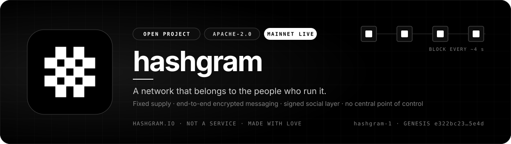</a>
</div>

## 🕊️ Hashgram — a project for people, not a service

<div align="center">


<br/><br/>

<a href="https://hashgram.io"></a>
<a href="https://github.com/deepdrogo/hashgram_windows/releases/latest"></a>
<a href="https://github.com/deepdrogo/hashgram"></a>
<a href="https://github.com/deepdrogo/hashgram_io"></a>
<a href="https://hashgram.io/docs"></a>
<a href="https://hashgram.io/api/v1/docs"></a>

</div>

<br/>

> **Please read this line first.** Everything above this banner is Drogoz Network — software you rent, with a manager, a price and an SLA. **Hashgram is none of those things.** It is not in the catalogue, it has no price, no manager, no client panel and no support contract. Nothing is hosted *for* you. It is an open-source network that I designed and built in my own time and released to everyone under Apache-2.0, because I believe people deserve a place to talk, to publish and to hold value that no company — including mine — can switch off, read, or take away.
>
> It is made with love. It belongs to whoever chooses to run it.

### 🌱 Why it was created

I have spent my career in cryptography and security, and I have watched the same pattern repeat: a network starts as a promise of freedom and ends as a database with a terms-of-service page. The messages are readable by the operator. The account can be frozen. The supply can be printed. The rules can be changed on a Tuesday, and the "community" finds out on Wednesday.

Hashgram is my answer to that pattern. It is built around three freedoms that are **enforced by code, not by policy**:

<table>
<tr>
<td align="center" valign="top" width="33%">
<br/><br/><br/>
<b>Freedom to hold</b><br/><br/>
<sub>1,000,000,000 HASH, created once in the genesis block. The mint module is not "set to zero" — it is <b>not compiled into the binary</b>. Nobody can print more, tax a transfer, freeze a balance or reverse a payment. There is no transaction type that does these things.</sub><br/><br/>
</td>
<td align="center" valign="top" width="33%">
<br/><br/><br/>
<b>Freedom to speak</b><br/><br/>
<sub>Private messages are <b>end-to-end encrypted with MLS</b>. Nodes carry ciphertext and sizes, never plaintext — an acceptance test greps their databases to prove it. Public posts are signed by your own device keys and verified by every reader; a node can refuse to relay, it can never forge.</sub><br/><br/>
</td>
<td align="center" valign="top" width="33%">
<br/><br/><br/>
<b>Freedom to be anonymous</b><br/><br/>
<sub>An account is <b>24 words</b>. No e-mail, no phone number, no password database, no sign-up server. People find you by public key or by an optional on-chain <code>@username</code>. Nodes log no full IP addresses (truncated to /24 or /48) and no content — the logging policy is part of the protocol, not a promise.</sub><br/><br/>
</td>
</tr>
</table>

And a fourth principle that holds the other three together: **honesty**. The documentation is written from the code, and where something is not built, it says so in plain words. `docs/DECENTRALIZATION.md` is a list of where control *still* sits today — one implementation, one seed operator, a founder who wrote the code and holds a vesting allocation. I would rather publish that list than pretend it is empty.

### 🧭 What Hashgram is

**A Layer-1 network with a fixed supply, a finite reward reserve, end-to-end encrypted messaging, a signed social layer, and no central point of control.** Three ideas hold it together:

| | Idea | What it means in practice |
|:-:|---|---|
| **1** | **The chain decides who owns what** | Coins, identities, device keys, `@usernames`, provider bonds — and it settles rewards. It is small and boring on purpose. Message content never touches the chain. |
| **2** | **The node network moves bytes** | Encrypted messages, public posts, media and calls travel peer-to-peer over libp2p. Nodes are paid from a finite reserve for **useful service** — bytes actually stored, relayed and served — on evidence the served client signed. There is no mining. |
| **3** | **The client trusts nobody for content** | Every blob is hash-checked, every social event is signature-checked against on-chain device keys, every message is authenticated by MLS. Nodes are interchangeable providers of availability, nothing more. |

### 🔒 What the code makes impossible

These are not policies. There is no transaction that does them and no code path that reaches them. Changing any of them requires a **new binary that the validator set consciously adopts** — deliberately the only bar available.

| Impossible | Why |
|---|---|
| Create new HASH | `x/mint` is not wired into the application; no module account holds the `Minter` permission — a test asserts both |
| Tax a transfer | Send 100 HASH, the recipient gets exactly 100 HASH. The fee router only ever touches fees the protocol already collected |
| Raise the founder share above 1 % of **fee revenue** | Compile-time ceiling of 100 basis points; `Validate` rejects a higher value, so the proposal fails |
| Freeze or seize an account | No admin module, no blacklist, no such message type |
| Reverse a confirmed transfer | No such message type |
| Disable a message type | `x/circuit`, which exists in the SDK for exactly this, is deliberately not wired in |
| Recover an account administratively | No component holds a user's private key — ever |
| Read a private message from a server | MLS end-to-end encryption; store nodes hold ciphertext only |
| Silently route a node onto a different chain | The genesis hash `e322bc23…5e4d` is compiled into every binary and checked on every handshake; a mismatch is "wrong network", never a peer |

### 🏗️ Architecture

Consensus carries **only what must be globally agreed**. Everything a person says, posts or shares travels off-chain, peer-to-peer, encrypted — because putting messages on a chain makes them permanent, public and replicated forever, which is the wrong trade for a messenger.


```mermaid
%%{init: {'theme': 'dark', 'themeVariables': { 'primaryColor': '#1a1a1a', 'primaryTextColor': '#ffffff', 'primaryBorderColor': '#808080', 'lineColor': '#808080', 'secondaryColor': '#0d0d0d', 'tertiaryColor': '#0d0d0d', 'clusterBkg': '#0d0d0d', 'clusterBorder': '#404040', 'edgeLabelBackground': '#0d0d0d', 'fontFamily': 'Inter, Segoe UI, sans-serif' } } }%%
flowchart LR
  subgraph Chain["Layer 1 — hashgramd · Go · Cosmos SDK v0.53 / CometBFT v0.38"]
    direction TB
    C1["CometBFT consensus · ~4 s blocks"]
    C2["bank · staking · gov · vesting"]
    C3["x/founder · x/feerouter · x/treasury"]
    C4["x/identity · x/username · x/network"]
    C5["x/serviceproof — Proof of Useful Service"]
  end

  subgraph P2P["Off-chain network — hashgram-node · Rust · libp2p"]
    direction TB
    N1["Genesis-checking handshake"]
    N2["MLS mailboxes · store-and-forward"]
    N3["Signed social events · gossip"]
    N4["Content-addressed media · storage challenges"]
    N5["Call discovery · TURN / SFU"]
    N6["Rewards agent · signed receipts"]
  end

  subgraph Clients["Clients — hashgram-sdk · Rust"]
    direction TB
    S1["Vault · 24-word keys · Argon2id"]
    S2["Wallet · staking · @usernames"]
    S3["Messaging · feed · reels · calls"]
  end

  Clients -- "REST / RPC — chain reads, tx broadcast" --> Chain
  Clients -- "QUIC / TCP :26670" --> P2P
  P2P -- "receipts · challenges · registrations" --> Chain
  Chain -- "identities · devices · names · params" --> P2P
```

<br/>

<details>
<summary><b>✉️ A message, end to end</b> — what a node sees, and what it never sees</summary>
<br/>

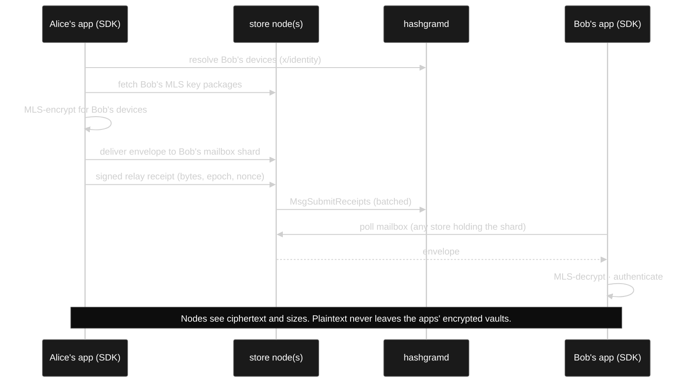
```mermaid
%%{init: {'theme': 'dark', 'themeVariables': { 'primaryColor': '#1a1a1a', 'primaryTextColor': '#ffffff', 'primaryBorderColor': '#808080', 'lineColor': '#808080', 'secondaryColor': '#0d0d0d', 'tertiaryColor': '#0d0d0d', 'actorBkg': '#1a1a1a', 'actorBorder': '#808080', 'actorTextColor': '#ffffff', 'signalColor': '#cfcfcf', 'signalTextColor': '#cfcfcf', 'noteBkgColor': '#0d0d0d', 'noteTextColor': '#ffffff', 'noteBorderColor': '#404040', 'fontFamily': 'Inter, Segoe UI, sans-serif' } } }%%
sequenceDiagram
  participant A as Alice's app (SDK)
  participant SA as store node(s)
  participant Chain as hashgramd
  participant B as Bob's app (SDK)

  A->>Chain: resolve Bob's devices (x/identity)
  A->>SA: fetch Bob's MLS key packages
  A->>A: MLS-encrypt for Bob's devices
  A->>SA: deliver envelope to Bob's mailbox shard
  A->>SA: signed relay receipt (bytes, epoch, nonce)
  SA->>Chain: MsgSubmitReceipts (batched)
  B->>SA: poll mailbox (any store holding the shard)
  SA-->>B: envelope
  B->>B: MLS-decrypt · authenticate
  Note over A,B: Nodes see ciphertext and sizes. Plaintext never leaves the apps' encrypted vaults.
```

</details>

<details>
<summary><b>💸 Where a fee goes</b> — and why the principal is never touched</summary>
<br/>

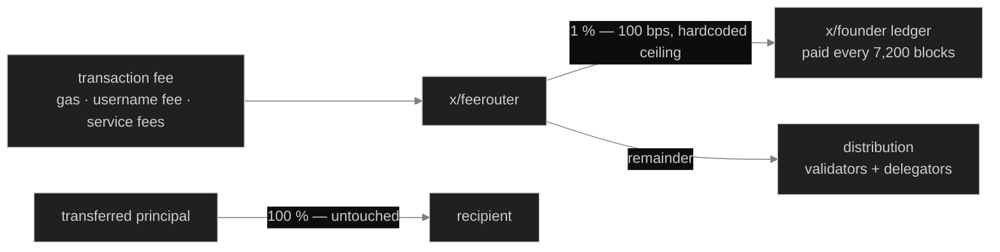
```mermaid
%%{init: {'theme': 'dark', 'themeVariables': { 'primaryColor': '#1a1a1a', 'primaryTextColor': '#ffffff', 'primaryBorderColor': '#808080', 'lineColor': '#808080', 'secondaryColor': '#0d0d0d', 'tertiaryColor': '#0d0d0d', 'edgeLabelBackground': '#0d0d0d', 'fontFamily': 'Inter, Segoe UI, sans-serif' } } }%%
flowchart LR
  TX["transaction fee<br/>gas · username fee · service fees"] --> FR["x/feerouter"]
  FR -->|"1 % — 100 bps, hardcoded ceiling"| FO["x/founder ledger<br/>paid every 7,200 blocks"]
  FR -->|"remainder"| DI["distribution<br/>validators + delegators"]
  P["transferred principal"] -->|"100 % — untouched"| RC["recipient"]
```

</details>

<details>
<summary><b>🔑 Keys</b> — one mnemonic, many devices, no server in the loop</summary>
<br/>

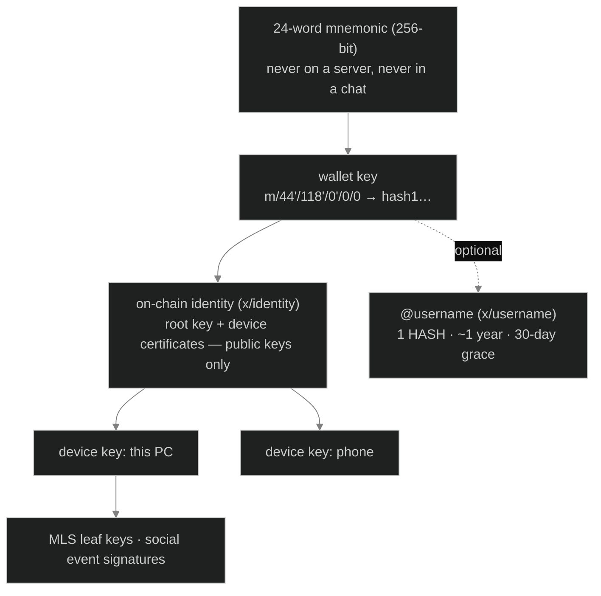
```mermaid
%%{init: {'theme': 'dark', 'themeVariables': { 'primaryColor': '#1a1a1a', 'primaryTextColor': '#ffffff', 'primaryBorderColor': '#808080', 'lineColor': '#808080', 'secondaryColor': '#0d0d0d', 'tertiaryColor': '#0d0d0d', 'clusterBkg': '#0d0d0d', 'clusterBorder': '#404040', 'edgeLabelBackground': '#0d0d0d', 'fontFamily': 'Inter, Segoe UI, sans-serif' } } }%%
flowchart TB
  M["24-word mnemonic (256-bit)<br/>never on a server, never in a chat"] --> W["wallet key<br/>m/44'/118'/0'/0/0 → hash1…"]
  W --> ID["on-chain identity (x/identity)<br/>root key + device certificates — public keys only"]
  ID --> D1["device key: this PC"]
  ID --> D2["device key: phone"]
  D1 --> MLS["MLS leaf keys · social event signatures"]
  W -.->|"optional"| UN["@username (x/username)<br/>1 HASH · ~1 year · 30-day grace"]
```

</details>

<details>
<summary><b>🧩 How a brand-new node finds the network</b> — the same five layers Bitcoin uses</summary>
<br/>

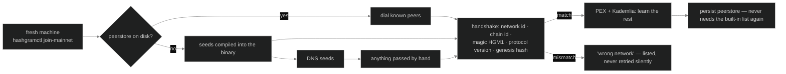
```mermaid
%%{init: {'theme': 'dark', 'themeVariables': { 'primaryColor': '#1a1a1a', 'primaryTextColor': '#ffffff', 'primaryBorderColor': '#808080', 'lineColor': '#808080', 'secondaryColor': '#0d0d0d', 'tertiaryColor': '#0d0d0d', 'edgeLabelBackground': '#0d0d0d', 'fontFamily': 'Inter, Segoe UI, sans-serif' } } }%%
flowchart LR
  A["fresh machine<br/>hashgramctl join-mainnet"] --> B{"peerstore on disk?"}
  B -- yes --> E["dial known peers"]
  B -- no --> C["seeds compiled into the binary"]
  C --> D2["DNS seeds"]
  D2 --> F["anything passed by hand"]
  E --> G["handshake: network id · chain id ·<br/>magic HGM1 · protocol version · genesis hash"]
  C --> G
  F --> G
  G -- match --> H["PEX + Kademlia: learn the rest"]
  G -- mismatch --> X["'wrong network' — listed, never retried silently"]
  H --> I2["persist peerstore — never needs the built-in list again"]
```

A blocked or hijacked seed can withhold peers from a brand-new node; it can **never** route it onto a different chain.

</details>

### 🪙 Mainnet at a glance

<table>
<tr>
<td align="center" valign="top" width="25%"><br/><b>hashgram-1</b><br/><sub>chain id · launched 2026-09-10 13:01:34 UTC</sub><br/><br/></td>
<td align="center" valign="top" width="25%"><br/><b>1,000,000,000 HASH</b><br/><sub>fixed · 1 HASH = 1,000,000 uhash · no mint module</sub><br/><br/></td>
<td align="center" valign="top" width="25%"><br/><b>~4 s</b><br/><sub>block time · CometBFT v0.38 · bech32 <code>hash</code> · coin type 118</sub><br/><br/></td>
<td align="center" valign="top" width="25%"><br/><b>e322bc23…5e4d</b><br/><sub>genesis SHA-256, compiled into every Go and Rust binary</sub><br/><br/></td>
</tr>
</table>

| | |
|---|---|
| **Consensus** | Cosmos SDK v0.53 / CometBFT v0.38 · eight custom modules · `x/mint` and `x/circuit` excluded on purpose |
| **Governance** | Voting period 7 days · quorum 40 % · threshold 50 % · veto 33.4 % · unbonding 21 days |
| **Founder share** | **1 % of protocol fee revenue** — never of transfers — paid every 7,200 blocks, ceiling hardcoded at 100 bps |
| **Reward reserve** | **500,000,000 HASH** at genesis, finite, cannot be topped up. Budget per epoch = `min(remaining × 5 / 10,000, 250,000 HASH)`; a single provider may take at most 5 % |
| **Node roles** | validator · relay · store · media · bootstrap · call · indexer · safety — one machine can run several |
| **Join** | `hashgramctl join-mainnet` — no arguments: genesis, hash and seeds are built in |

<details>
<summary><b>Genesis distribution</b> — every number is a compile-time constant, not a governance parameter</summary>
<br/>

| Allocation | HASH | Share | Held by |
|---|---:|---:|---|
| Useful-service reserve | 500,000,000 | 50 % | `x/serviceproof` — paid only for real bytes stored, relayed and served |
| Founder | 200,000,000 | 20 % | 20M spendable · 180M vesting monthly over **eight years** |
| Treasury | 150,000,000 | 15 % | spendable only by governance proposal |
| Growth | 50,000,000 | 5 % | includes the 1,850,000 HASH welcome pool |
| Developer grants | 50,000,000 | 5 % | governance only |
| Liquidity | 50,000,000 | 5 % | governance only |

Emission from the reserve asymptotes rather than hitting a cliff: ≈ 16.7 % paid out after 1 year, ≈ 59.9 % after 5 years, ≈ 83.9 % after 10 years — and only if the bytes were actually served. Unearned budget stays in the reserve.

</details>

### 📦 Three public repositories

Everything a node runs is public. Everything a client needs is public. Nothing is hidden behind a service.

<table>
<tr>
<td align="center" valign="top" width="33%">
<a href="https://github.com/deepdrogo/hashgram"></a><br/><br/>
<a href="https://github.com/deepdrogo/hashgram"><b>hashgram</b></a> — Core<br/>
<sub>The blockchain (Go, Cosmos SDK / CometBFT), the peer-to-peer node (Rust, libp2p, OpenMLS), the client SDK (Rust), the indexer and safety engine (Go), operator tooling, hardened systemd units, Grafana dashboards and the genesis that launched Mainnet.</sub><br/><br/>
   <br/><br/>
<sub><a href="https://github.com/deepdrogo/hashgram#quick-start">Run a node</a> · <a href="https://github.com/deepdrogo/hashgram/tree/main/docs">Docs</a> · <a href="https://github.com/deepdrogo/hashgram/tree/main/sdk/rust/hashgram-sdk">SDK</a></sub>
</td>
<td align="center" valign="top" width="33%">
<a href="https://github.com/deepdrogo/hashgram_io"></a><br/><br/>
<a href="https://github.com/deepdrogo/hashgram_io"><b>hashgram_io</b></a> — Explorer<br/>
<sub>The official live explorer, network dashboard and rendered documentation at <a href="https://hashgram.io">hashgram.io</a>. SolidJS + Vite, strict seven-colour monochrome, read-only, no cookies, no analytics, no third-party scripts. Runs on its own full node and pins the genesis hash — if the API ever served a different chain, the site disables itself.</sub><br/><br/>
   <br/><br/>
<sub><a href="https://hashgram.io">Website</a> · <a href="https://hashgram.io/api/v1/docs">Read API</a> · <a href="https://hashgram.io/brand">Brand kit</a></sub>
</td>
<td align="center" valign="top" width="33%">
<a href="https://github.com/deepdrogo/hashgram_windows"></a><br/><br/>
<a href="https://github.com/deepdrogo/hashgram_windows"><b>hashgram_windows</b></a> — Windows app<br/>
<sub>Wallet, messenger (MLS), feed, reels, channels, calls, identity, Founder and Supply views, Network panel and <b>Earn</b> — run a node from your own PC. Tauri 2 + Rust + SolidJS. Encrypted vault (Argon2id, XChaCha20-Poly1305), Windows Hello unlock, self-updates from GitHub Releases verified by a compiled-in minisign key.</sub><br/><br/>
  <br/><br/>
<sub><a href="https://github.com/deepdrogo/hashgram_windows/releases/latest">Download</a> · <a href="https://github.com/deepdrogo/hashgram_windows/tree/main/apps/desktop">Source</a> · <a href="https://github.com/deepdrogo/hashgram/blob/main/docs/PROMPT_DESKTOP_AI.md">Spec</a></sub>
</td>
</tr>
</table>

### 🖥️ hashgram.io — the official window into the network

hashgram.io is where anyone can **watch the decentralised system as it runs** — block by block, in real time. It is trusted for the same reason the network is: it runs on its own full node that joined Mainnet through the compiled-in seed list like any other node, it is read-only (no wallet, no keys, no accounts, no analytics), and every number on it is reproducible from the chain by anyone who runs `hashgram-indexer rebuild`. Anyone can run their own copy. hashgram.io is the official one; it is not the only possible one — and that is the point.

<table>
<tr>
<td align="center" width="50%"><a href="https://hashgram.io">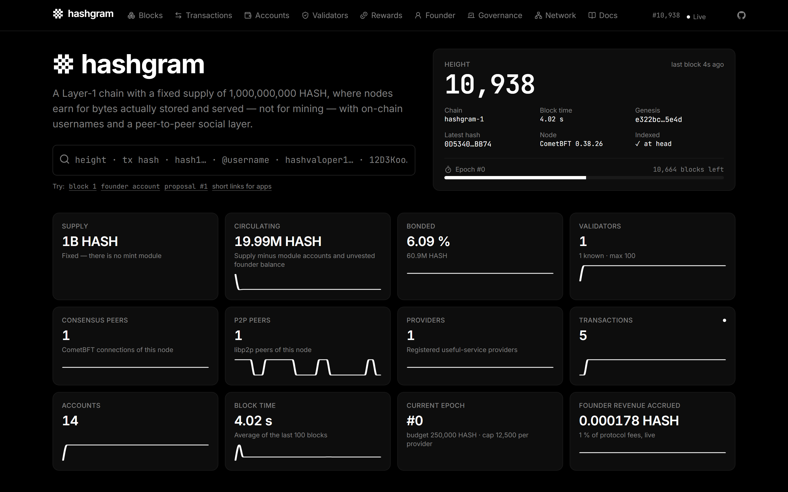</a><br/><sub><b>Home</b> — live height, chain facts, key statistics with 24-hour sparklines and the epoch progress bar. Search by height, tx hash, address, <code>@username</code>, validator or peer id.</sub></td>
<td align="center" width="50%"><a href="https://hashgram.io/blocks">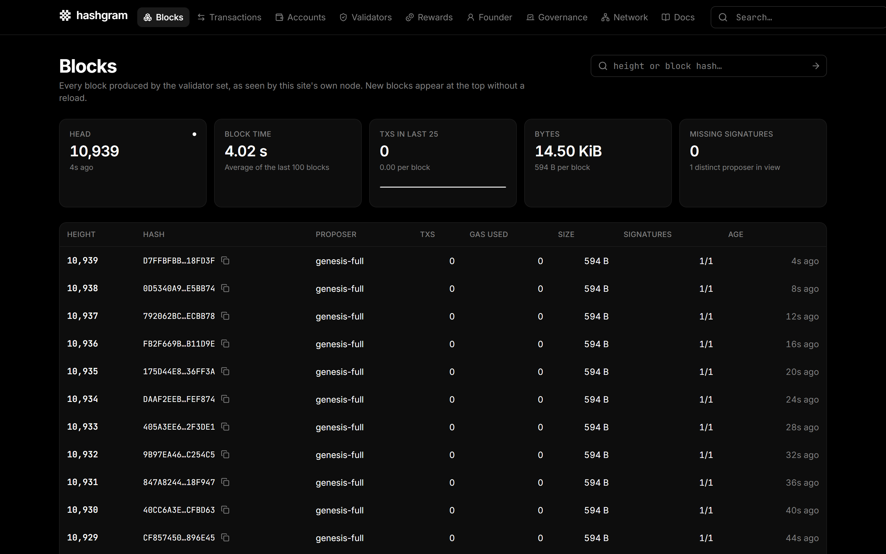</a><br/><sub><b>Blocks</b> — live-prepending list; proposer, gas, size and signatures present / missing for every block.</sub></td>
</tr>
<tr>
<td align="center" width="50%"><a href="https://hashgram.io/txs">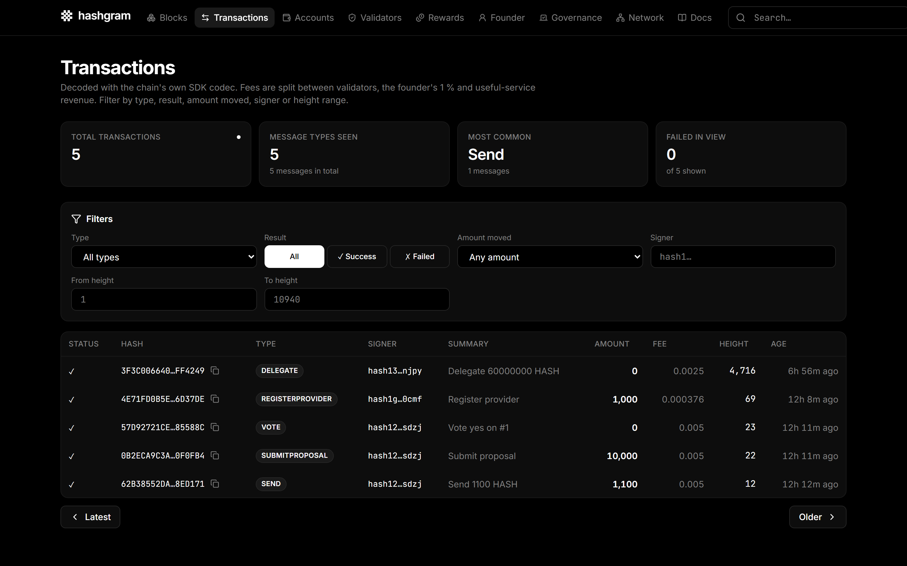</a><br/><sub><b>Transactions</b> — decoded by the chain's own codec; every fee split into validators / founder 1 % / treasury, so the "no transfer tax" claim is visible on every row.</sub></td>
<td align="center" width="50%"><a href="https://hashgram.io/accounts">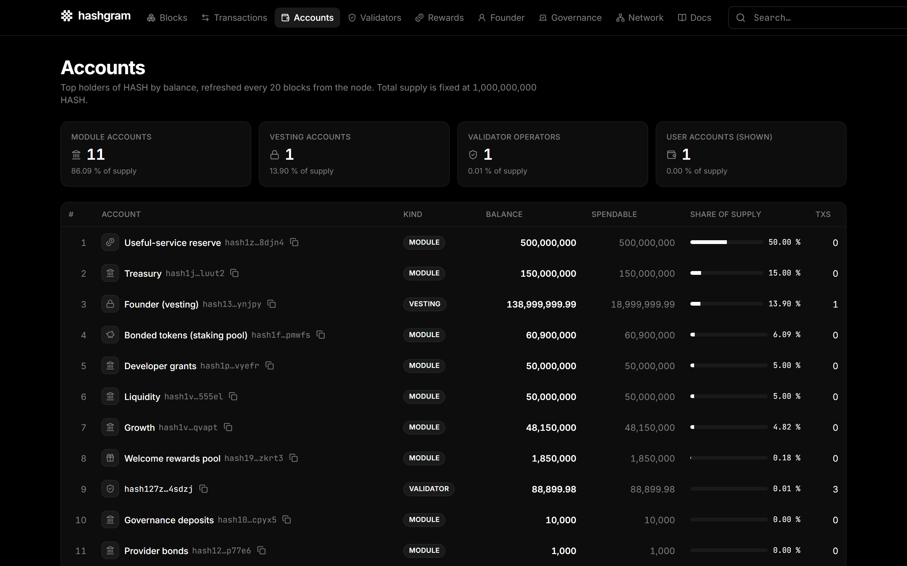</a><br/><sub><b>Accounts</b> — top holders with every module and reserve account labelled, spendable vs. vesting, share of supply.</sub></td>
</tr>
<tr>
<td align="center" width="50%"><a href="https://hashgram.io/validators">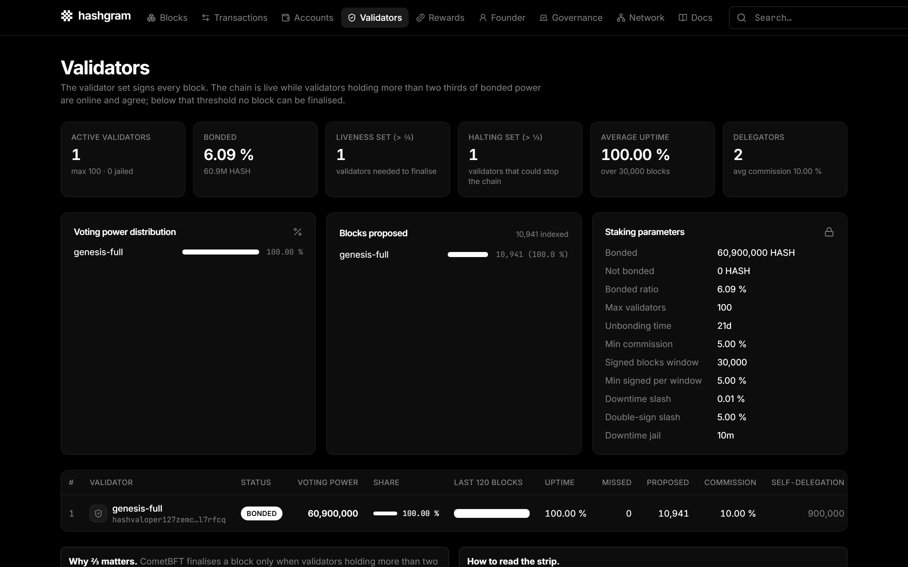</a><br/><sub><b>Validators</b> — voting-power distribution, the ⅔ liveness and ⅓ halting sets, uptime strips of the last 120 blocks.</sub></td>
<td align="center" width="50%"><a href="https://hashgram.io/rewards">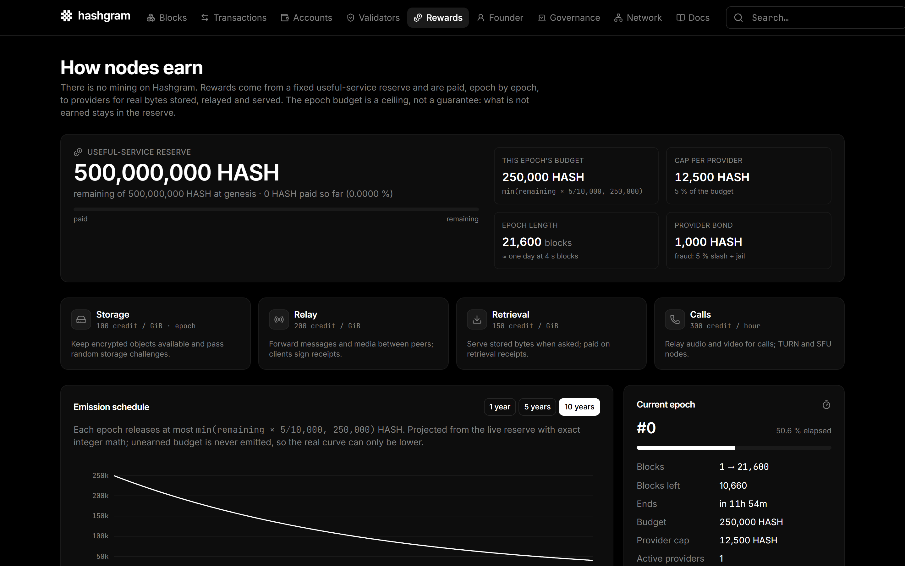</a><br/><sub><b>Rewards — how nodes earn.</b> The 500,000,000 HASH reserve, this epoch's budget and per-provider cap, the exact emission rule projected 1 / 5 / 10 years. <i>There is no mining.</i></sub></td>
</tr>
<tr>
<td align="center" width="50%"><a href="https://hashgram.io/founder">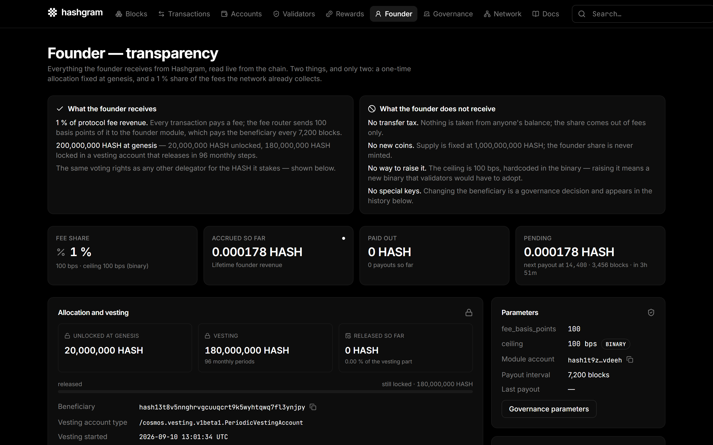</a><br/><sub><b>Founder — transparency.</b> What the founder receives and does <i>not</i> receive, read live from the chain: the 96-step vesting chart, accrued / paid / pending fee share, payout history.</sub></td>
<td align="center" width="50%"><a href="https://hashgram.io/governance">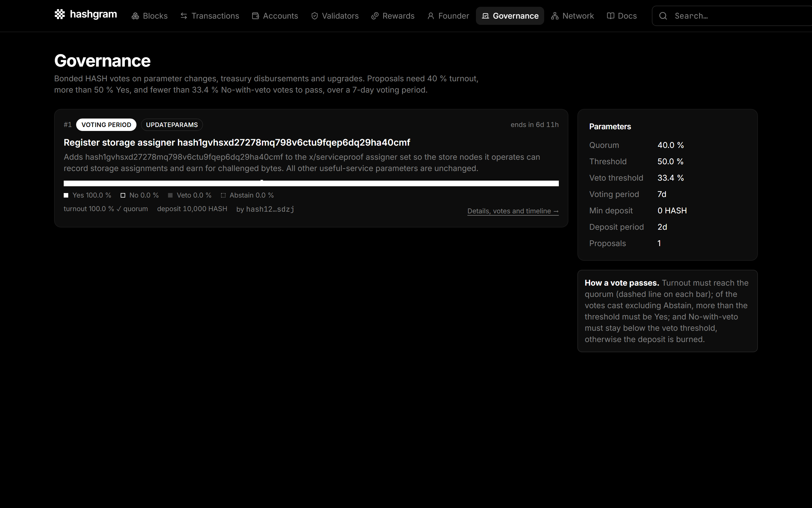</a><br/><sub><b>Governance</b> — proposals with tally bars against quorum, decoded messages with parameter diffs, votes and timeline.</sub></td>
</tr>
<tr>
<td align="center" width="50%"><a href="https://hashgram.io/network">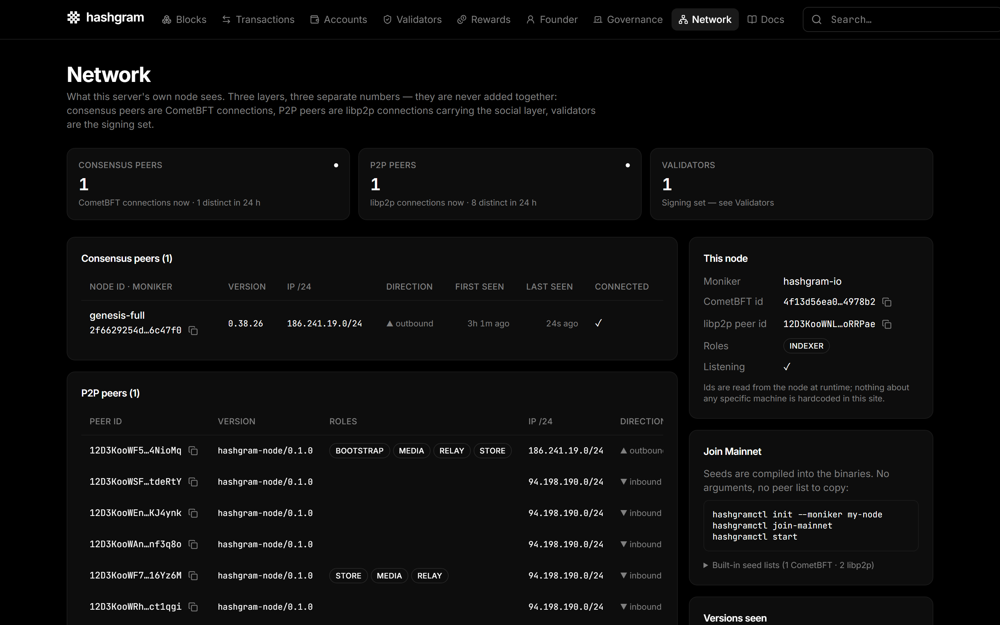</a><br/><sub><b>Network</b> — consensus peers, libp2p peers and validators as three honest numbers, never one invented total; peer tables with /24 prefixes only; the built-in seeds.</sub></td>
<td align="center" width="50%"><a href="https://hashgram.io/status">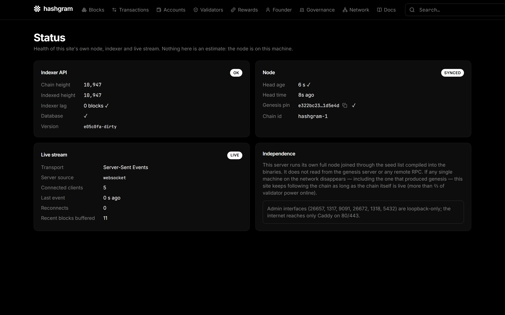</a><br/><sub><b>Status</b> — node sync, indexer lag, event-stream state and the genesis pin check. Nothing here is an estimate.</sub></td>
</tr>
<tr>
<td align="center" width="50%"><a href="https://hashgram.io/docs">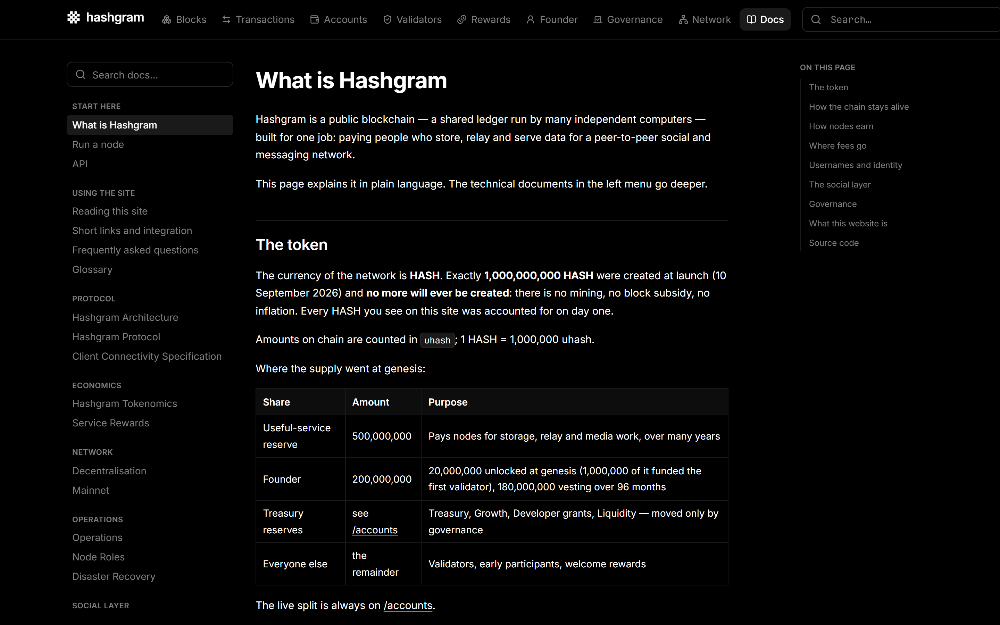</a><br/><sub><b>Docs</b> — the repository's documentation rendered with navigation, full-text search and source commit — written from the code, saying "not built" where it is not.</sub></td>
<td align="center" width="50%"><a href="https://hashgram.io/brand">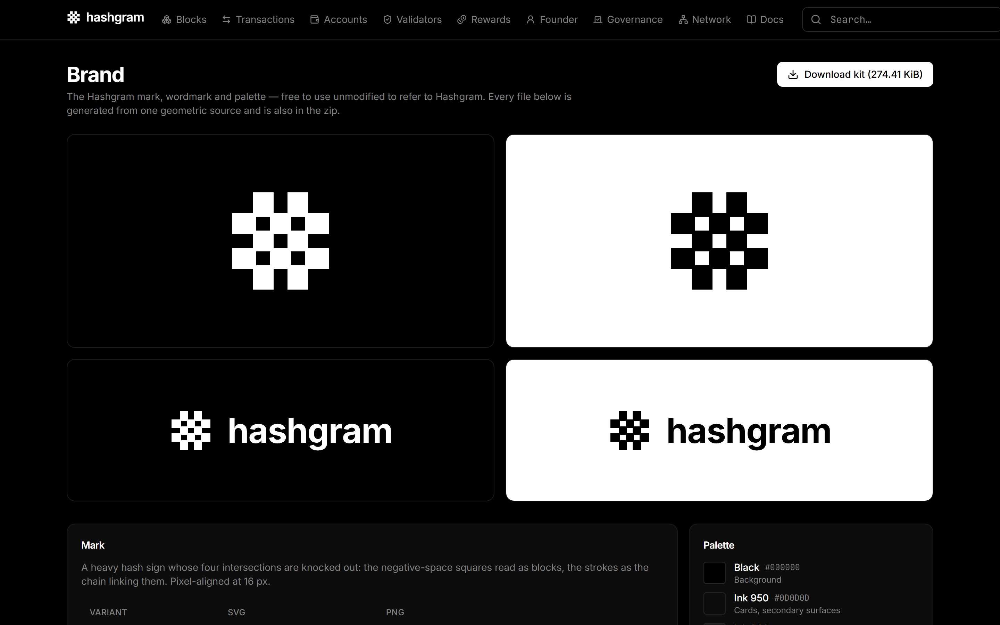</a><br/><sub><b>Brand</b> — the mark, wordmark and seven-colour palette, free to use unmodified to refer to Hashgram, downloadable as one kit.</sub></td>
</tr>
</table>

<div align="center">
<br/>
<sub><b>Designed for phones first</b> — stat grids collapse to two columns, tables become labelled cards, and a Playwright suite checks every route at iPhone size for overflow.</sub>
<br/><br/>
<a href="https://hashgram.io">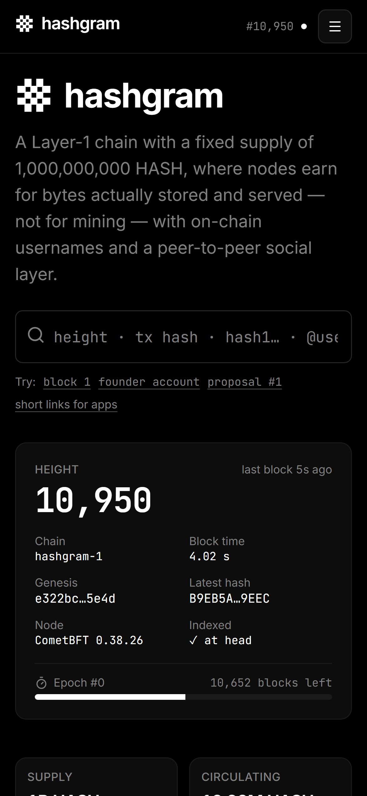</a>&nbsp;&nbsp;&nbsp;
<a href="https://hashgram.io/rewards">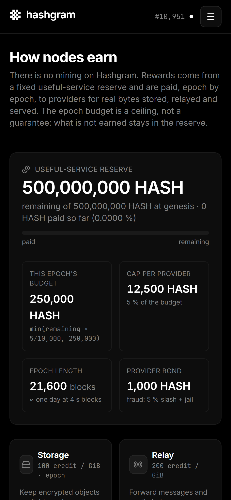</a>&nbsp;&nbsp;&nbsp;
<a href="https://hashgram.io/txs">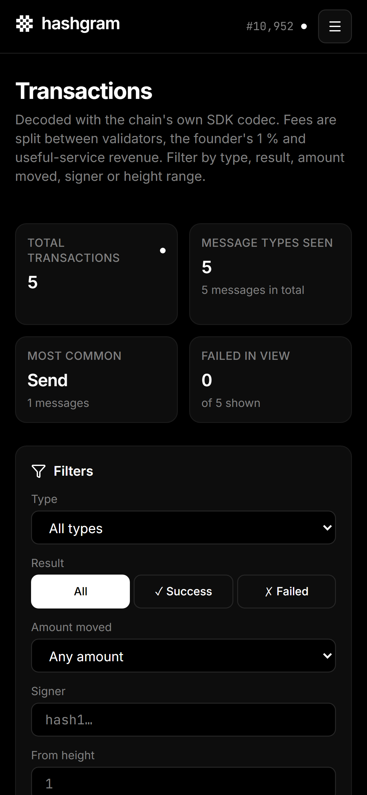</a>
<br/><br/>
</div>

### 🪟 Hashgram for Windows

One application that talks to the Hashgram peer-to-peer network — **never to one server**.

| | |
|---|---|
| **Wallet** | Send, receive, stake and delegate HASH. Register an `@username`. Every amount is exact integer `uhash` — no floats, no rounding. |
| **Messenger** | MLS end-to-end encrypted one-to-one and group chats, delivered through interchangeable store nodes. Nodes see ciphertext and sizes only. |
| **Feed · Reels · Channels** | Public posts, short videos and channels as signed social events, verified against on-chain device keys by every reader. |
| **Calls** | Audio and video via TURN credentials issued by call nodes; E2EE signalling. |
| **Identity** | A 24-word account. Login *is* restore. Add devices with certificates, recover socially with a delay. A display name is never shown without the verified `@username` or address. |
| **Earn** | Run a relay / store / media node from your own PC and be paid from the reserve for bytes you actually serve. |
| **Security** | Encrypted vault (Argon2id, XChaCha20-Poly1305 sealed columns), DPAPI + Windows Hello unlock, nothing plaintext on disk, no hardcoded server address anywhere. |
| **Updates** | Self-updates from GitHub Releases; only manifests signed by the project's compiled-in minisign key are accepted. |

<div align="center">
<br/>
<a href="https://github.com/deepdrogo/hashgram_windows/releases/latest"></a>
<a href="https://github.com/deepdrogo/hashgram_windows/releases/latest/download/SHA256SUMS.txt"></a>
<br/><br/>
<sub>Per-user installer, no administrator prompt. Not yet Authenticode-signed, so Windows SmartScreen will warn on first run — verify the SHA-256 against <code>SHA256SUMS.txt</code>. That is the honest state today, not a hidden one.</sub>
<br/><br/>
</div>

### 🚀 Take part

There is no waiting list and nobody to ask. Pick the way in that suits you:

<table>
<tr>
<td valign="top" width="33%">

**Run a node and earn**

Ubuntu Server 24.04, a public IPv4, ports 26656 and 26670 open.

```bash
git clone https://github.com/deepdrogo/hashgram
cd hashgram
sudo scripts/install/bootstrap-ubuntu.sh
hashgramctl init --moniker <your-name>
hashgramctl join-mainnet
hashgramctl configure-role relay,store,media \
  --reward-address hash1<cold address>
hashgramctl start
```

<sub>Bond 1,000 HASH to register as a provider. <code>hashgramctl rewards</code> shows credit and payouts. To validate: <a href="https://github.com/deepdrogo/hashgram/blob/main/docs/MAINNET.md">docs/MAINNET.md</a>.</sub>

</td>
<td valign="top" width="33%">

**Use it**

Download the Windows app, write down your 24 words, and you have a wallet, a messenger and a social network with no account, no e-mail and no phone number.

```text
Ctrl+K  search
Ctrl+L  lock the vault
F1      help
```

<sub>Your keys never leave your machine. Lose the 24 words and nobody — not me, not a node, not a court order — can restore them. That is the trade, stated plainly.</sub>

</td>
<td valign="top" width="33%">

**Build on it**

The Rust SDK covers account, link, messaging, social, blob and calls. iOS and Android specifications are complete build prompts that name only endpoints that exist.

```bash
hashgram-client configure --network mainnet \
  --genesis-hash e322bc23…5e4d
hashgram-client net peers
```

<sub><a href="https://github.com/deepdrogo/hashgram/blob/main/docs/CLIENT_CONNECTIVITY_SPEC.md">Client connectivity spec</a> · <a href="https://github.com/deepdrogo/hashgram/blob/main/docs/PROMPT_IOS_APP.md">iOS</a> · <a href="https://github.com/deepdrogo/hashgram/blob/main/docs/PROMPT_ANDROID_APP.md">Android</a> · <a href="https://hashgram.io/api/v1/docs">Read API</a></sub>

</td>
</tr>
</table>

### 📋 Status — honest

| Component | State |
|---|---|
| Mainnet `hashgram-1` | **Live since 2026-09-10.** One genesis validator today; more are needed — with equal stake, four validators is the first configuration that survives losing one |
| Blockchain, eight modules, genesis tooling | Complete, tested, running |
| `hashgram-node`, `hashgram-sdk`, `hashgram-client` | Complete; 63 network-level acceptance checks pass |
| hashgram.io explorer, indexer, safety engine | Complete and live |
| Hashgram for Windows | **v0.1.0 released** — first public build, self-updating |
| Useful-service rewards | Live: reserve funded, first provider registered |
| iOS / Android apps, push notifications, SFU group-call E2EE, token bridge | Not built — specifications exist, and the docs say so |

I publish this table because a decentralised network with one validator is a design, not yet a deployment. The code makes the important things impossible; the deployment becomes resilient only when **independent people in different places** run it. If that is you — welcome.

### 🎨 Brand

<div align="center">
<br/>
&nbsp;&nbsp;&nbsp;&nbsp;

<br/><br/>
<sub>A heavy <code>#</code> — four strokes on a 64-unit grid with the four intersections knocked out: the negative-space squares read as blocks, the strokes as the chain that links them. One colour, no gradients. Strict monochrome palette of seven values, <code>#000000</code> → <code>#FFFFFF</code>. The full kit is free at <a href="https://hashgram.io/brand">hashgram.io/brand</a>.</sub>
<br/><br/>
</div>

<div align="center">

<a href="https://hashgram.io"></a>
<a href="https://github.com/deepdrogo/hashgram"></a>
<a href="https://github.com/deepdrogo/hashgram_io"></a>
<a href="https://github.com/deepdrogo/hashgram_windows"></a>
<a href="https://github.com/deepdrogo/hashgram/security/policy"></a>

<br/><br/>

<sub><b>Hashgram is free software under Apache-2.0.</b> It is not a Drogoz Network product, it has no price and no support contract, and nothing about it is for sale. It exists so that ordinary people have one place where their money, their words and their names are theirs — made with love, for everyone.</sub>

</div>

<br/>


## 🧰 Tech stack

<div align="center">

     

<br/><br/>

<a href="https://skillicons.dev"></a>

<br/><br/>

<sub>Django · PostgreSQL · Redis · Celery back-ends · WebSocket real-time delivery · CUDA-accelerated neural pipelines · Ethereum / ERC-20 tooling · native Windows desktop clients · Telegram automation</sub>

</div>


## 📊 GitHub stats

<div align="center">


<br/>


</div>


## 📬 Contact

<div align="center">

| Channel | Link |
|---|---|
| 🌐 **Website** | [drogoz.network](https://drogoz.network) |
| ✈️ **Telegram** | [@drogoz](https://t.me/drogoz) — registration, demonstrations and support |
| ✉️ **Email** | [hello@drogoz.network](mailto:hello@drogoz.network) |
| 🔐 **Client panel** | [drogoz.network/accounts/login](https://drogoz.network/accounts/login/) |
| 📑 **Presentation** | [Catalog & presentation PDFs](https://drogoz.network/presentation/) |
| ⚖️ **Legal Center** | [Terms](https://drogoz.network/legal/terms-of-service/) · [Acceptable Use](https://drogoz.network/legal/acceptable-use-policy/) · [Privacy](https://drogoz.network/legal/privacy-policy/) · [Refunds](https://drogoz.network/legal/refund-policy/) · [Compliance](https://drogoz.network/legal/compliance-policy/) |

<br/>

**Ready to get started?** Registration is handled by our team — get in touch and receive personal access.

<a href="https://t.me/drogoz"></a>
<a href="https://drogoz.network/accounts/login/"></a>

</div>

<br/>


<div align="center">
  <br/>
  <a href="https://drogoz.network"></a>
  <br/><br/>
  <b>Made by <a href="https://drogoz.network">Drogoz Network</a></b><br/>
  <sub>One network — all your services · Premium SaaS Network</sub>
  <br/><br/>
  <sub><a href="https://github.com/deepdrogo/drog-ai">Drog AI</a> · <a href="https://github.com/deepdrogo/mymask-ai">MyMask AI</a> · <a href="https://github.com/deepdrogo/replika">Replika</a> · <a href="https://github.com/deepdrogo/lidaro-ai">Lidaro AI</a> · <a href="https://github.com/deepdrogo/imperatori">IMPERATORI</a> · <a href="https://github.com/deepdrogo/zoi-talks">ZOI Talks</a> · <a href="https://github.com/deepdrogo/riderswap-io">RiderSwap</a> · <a href="https://github.com/deepdrogo/hyperblast-ai">HyperBlast AI</a> · <a href="https://github.com/deepdrogo/verifhub-ai">VerifHub AI</a> · <a href="https://github.com/deepdrogo/vadira-net">Vadira</a> · <a href="https://github.com/deepdrogo/skriper-io">Skriper</a> · <a href="https://github.com/deepdrogo/mytasker">MyTasker</a> · <a href="https://github.com/deepdrogo/mamont-tech">Mamont</a> · <a href="https://github.com/deepdrogo/drogscan">DrogScan</a> · <a href="https://github.com/deepdrogo/drogopay-com">DrogoPay</a></sub>
  <br/><br/>
  <sub>Open project, not a service · <a href="https://hashgram.io">Hashgram</a> — <a href="https://github.com/deepdrogo/hashgram">Core</a> · <a href="https://github.com/deepdrogo/hashgram_io">Explorer</a> · <a href="https://github.com/deepdrogo/hashgram_windows">Windows app</a> · Apache-2.0</sub>
  <br/><br/>
  <sub>© 2026 Drogoz Network. All rights reserved. Provided strictly for lawful use — see the <a href="https://drogoz.network/legal/">Legal Center</a>.</sub>
</div>
