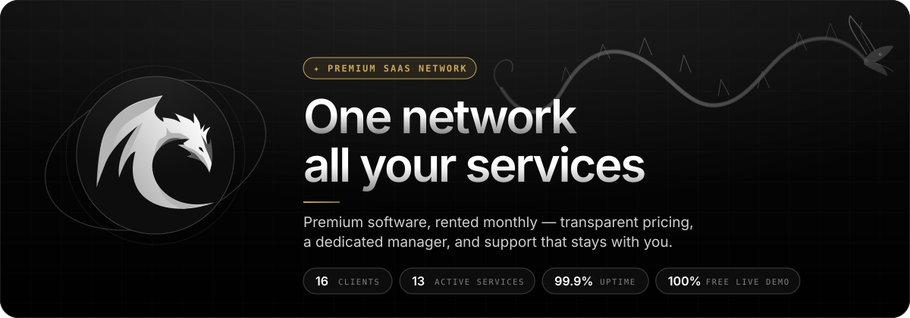

 

 

## Drogoz — founder of <a href="https://drogoz.network">Drogoz Network</a>

Specialist in **cryptography**, **cybersecurity**, **quantum computing**, **backend engineering** and **blockchain** — and the founder of **Drogoz Network**, a Premium SaaS Network where premium software is rented monthly with transparent pricing, a dedicated manager and support that stays with you.

Drogoz Network runs **15 live products** — from an unmetered AI workspace for developers and real-time face transformation, to a non-custodial crypto exchange, real-time crypto payment infrastructure, an outbound dialer that protects your numbers, enterprise email marketing, lead delivery, contact verification, endpoint management, Ethereum tooling, an always-free open-source task control center and an auditable cryptocurrency accounting platform for finance teams — with two more on the way. Every product can be seen live, for free, before you pay.

 

   

  

<table>
<tr>
<td align="center" width="33%"><b>01 · Reliable &amp; secure</b> Guarded access and infrastructure that holds — on every service you run.</td>
<td align="center" width="33%"><b>02 · Dedicated managers</b> Your own dedicated team, and a direct line of support — not a ticket queue.</td>
<td align="center" width="33%"><b>03 · Transparent pricing</b> Your exact monthly cost, in seconds. No quotes. Nothing hidden.</td>
</tr>
</table>

## 🗂️ Services

Pick a product and pay only for what you need — every service has its own repository with a full product README.

 

<table>
<tr>
<td align="center" valign="top" width="33%">
  
<a href="https://github.com/deepdrogo/drog-ai"><b>Drog AI</b></a> 
An AI workspace for professional developers — no token budget, no message caps, no throttling.  
   
<a href="https://drog.ai/">Website</a> · <a href="https://drogoz.network/services/drogai/">Details</a> · <a href="https://t.me/drog_ai">Telegram</a> · <a href="https://github.com/deepdrogo/drog-ai">Repo</a>
</td>
<td align="center" valign="top" width="33%">
  
<a href="https://github.com/deepdrogo/mymask-ai"><b>MyMask AI</b></a> 
Real-time, CUDA-accelerated AI face swapping for professional video calls.  
   
<a href="https://mymask.pro/">Website</a> · <a href="https://drogoz.network/services/MyMask/">Details</a> · <a href="https://t.me/mymask_ai">Telegram</a> · <a href="https://github.com/deepdrogo/mymask-ai">Repo</a>
</td>
<td align="center" valign="top" width="33%">
  
<a href="https://github.com/deepdrogo/replika"><b>Replika</b></a> 
Precision simulation platform with Windows, Chrome and manager builds, controlled from one panel.  
   
<a href="https://replika.software/">Website</a> · <a href="https://drogoz.network/services/replika/">Details</a> · <a href="https://t.me/replika_pro">Telegram</a> · <a href="https://github.com/deepdrogo/replika">Repo</a>
</td>
</tr>
<tr>
<td align="center" valign="top" width="33%">
  
<a href="https://github.com/deepdrogo/lidaro-ai"><b>Lidaro AI</b></a> 
Live lead marketplace connecting media buyers on Meta, Google and TikTok with the offices that buy their leads.  
   
<a href="https://lidaro.ai/">Website</a> · <a href="https://drogoz.network/services/Lidaro/">Details</a> · <a href="https://github.com/deepdrogo/lidaro-ai">Repo</a>
</td>
<td align="center" valign="top" width="33%">
  
<a href="https://github.com/deepdrogo/imperatori"><b>IMPERATORI</b></a> 
All-in-one remote support and endpoint management for IT professionals, MSPs and enterprises.  
   
<a href="https://drogoz.network/services/Imperatori/">Details</a> · <a href="https://github.com/deepdrogo/imperatori">Repo</a>
</td>
<td align="center" valign="top" width="33%">
  
<a href="https://github.com/deepdrogo/zoi-talks"><b>ZOI Talks</b></a> 
Browser dialer for teams that live on the phone — real calls from your own numbers, with built-in number protection.  
   
<a href="https://zoitalks.com/">Website</a> · <a href="https://drogoz.network/services/zoi-dialer/">Details</a> · <a href="https://github.com/deepdrogo/zoi-talks">Repo</a>
</td>
</tr>
<tr>
<td align="center" valign="top" width="33%">
  
<a href="https://github.com/deepdrogo/riderswap-io"><b>RiderSwap</b></a> 
Non-custodial instant cryptocurrency exchange — hundreds of assets at live rates, no sign-up, no hidden spread.  
   
<a href="https://riderswap.io/">Website</a> · <a href="https://drogoz.network/services/riderswap/">Details</a> · <a href="https://github.com/deepdrogo/riderswap-io">Repo</a>
</td>
<td align="center" valign="top" width="33%">
  
<a href="https://github.com/deepdrogo/hyperblast-ai"><b>HyperBlast AI</b></a> 
AI-powered bulk email marketing with SMTP rotation, proxy support, warm-up and real-time analytics.  
   
<a href="https://hyperblast.ai/">Website</a> · <a href="https://drogoz.network/services/HyperBlast/">Details</a> · <a href="https://t.me/hyperblast">Telegram</a> · <a href="https://github.com/deepdrogo/hyperblast-ai">Repo</a>
</td>
<td align="center" valign="top" width="33%">
  
<a href="https://github.com/deepdrogo/verifhub-ai"><b>VerifHub AI</b></a> 
Live SMTP email verification, live HLR carrier lookups and breach screening — 99.2% accuracy, 4,800 records a minute, 190+ countries, prepaid per record.  
   
<a href="https://verifhub.ai/">Website</a> · <a href="https://drogoz.network/services/VerifHub/">Details</a> · <a href="https://github.com/deepdrogo/verifhub-ai">Repo</a>
</td>
</tr>
<tr>
<td align="center" valign="top" width="33%">
  
<a href="https://github.com/deepdrogo/vadira-net"><b>Vadira</b></a> 
Non-custodial ERC-20 transaction platform with precision gas control and encrypted key management.  
   
<a href="https://vadira.net/">Website</a> · <a href="https://drogoz.network/services/vadira/">Details</a> · <a href="https://t.me/vadira_net">Telegram</a> · <a href="https://github.com/deepdrogo/vadira-net">Repo</a>
</td>
<td align="center" valign="top" width="33%">
  
<a href="https://github.com/deepdrogo/skriper-io"><b>Skriper</b></a> 
Browser-extension platform for support chat replacement, code injection, header & cookie handling, with a multi-agent CRM.  
   
<a href="https://skriper.io/">Website</a> · <a href="https://drogoz.network/services/Skriper/">Details</a> · <a href="https://t.me/skriper_io">Telegram</a> · <a href="https://github.com/deepdrogo/skriper-io">Repo</a>
</td>
<td align="center" valign="top" width="33%">
  
<a href="https://github.com/deepdrogo/mytasker"><b>MyTasker</b></a> 
An always-free control center for tasks, projects, prompts, routines, time tracking and teams — with a Telegram bot. Open source.  
    
<a href="https://mytasker.io/">Website</a> · <a href="https://drogoz.network/services/mytasker/">Details</a> · <a href="https://t.me/mytaskerproductiondrogoz_bot">Telegram</a> · <a href="https://github.com/deepdrogo/mytasker">Source code</a>
</td>
</tr>
<tr>
<td align="center" valign="top" width="33%">
  
<a href="https://github.com/deepdrogo/mamont-tech"><b>Mamont</b></a> 
Crypto-financial operations and accounting platform: an auditable chain from blockchain event to report, no economic event counted twice — with Team Chat, Drog AI and Telegram bots inside. Monthly licence.  
    
<a href="https://github.com/deepdrogo/mamont-tech">Repo</a>
</td>
<td align="center" valign="top" width="33%">
  
<a href="https://github.com/deepdrogo/drogscan"><b>DrogScan</b></a> 
Blockchain AML intelligence: wallet risk scoring, historical risk tracking, counterparty intelligence, relationship graphs and evidence-bound AI interpretation — across 16 networks, on the web and in Telegram.  
    
<a href="https://drogscan.com/">Website</a> · <a href="https://t.me/DrogScanBot">Telegram</a> · <a href="https://github.com/deepdrogo/drogscan">Repo</a>
</td>
<td align="center" valign="top" width="33%">
  
<a href="https://github.com/deepdrogo/drogopay-com"><b>DrogoPay</b></a> 
Real-time crypto payment infrastructure — hosted checkout, address-first detection, honest handling of wrong amounts, signed API and live settlement.  
    
<a href="https://drogopay.com/">Website</a> · <a href="https://drogopay.com/guide">Guide</a> · <a href="https://github.com/deepdrogo/drogopay-com">Repo</a>
</td>
</tr>
</table>

 

### ⏳ Coming soon

| Product | What it is | Status |
|---|---|---|
| **Delas** | A complete brokerage CRM platform designed for recovery teams. |  |
| **Brokerix** | A complete brokerage CRM platform designed for clean offices. |  |

## 📦 Packages &amp; bundles

Take several products together and save more — <a href="https://drogoz.network/accounts/login/">sign in</a> to see your bundle pricing.

 

| Bundle | Discount | Best for | Included |
|---|---|---|---|
| **Utilities** |  | Core utility tools | [Drog AI](https://github.com/deepdrogo/drog-ai), [MyMask AI](https://github.com/deepdrogo/mymask-ai), [Replika](https://github.com/deepdrogo/replika), [IMPERATORI](https://github.com/deepdrogo/imperatori), [RiderSwap](https://github.com/deepdrogo/riderswap-io), [Vadira](https://github.com/deepdrogo/vadira-net), [Skriper](https://github.com/deepdrogo/skriper-io) |
| **Traffic** |  | Everything for traffic ops | [Lidaro AI](https://github.com/deepdrogo/lidaro-ai), [HyperBlast AI](https://github.com/deepdrogo/hyperblast-ai), [VerifHub AI](https://github.com/deepdrogo/verifhub-ai) |
| **All In One** |  | Every product, best price | [Drog AI](https://github.com/deepdrogo/drog-ai), [MyMask AI](https://github.com/deepdrogo/mymask-ai), [Replika](https://github.com/deepdrogo/replika), [Lidaro AI](https://github.com/deepdrogo/lidaro-ai), [IMPERATORI](https://github.com/deepdrogo/imperatori), [ZOI Talks](https://github.com/deepdrogo/zoi-talks), [RiderSwap](https://github.com/deepdrogo/riderswap-io), [HyperBlast AI](https://github.com/deepdrogo/hyperblast-ai), [VerifHub AI](https://github.com/deepdrogo/verifhub-ai), [Vadira](https://github.com/deepdrogo/vadira-net), [Skriper](https://github.com/deepdrogo/skriper-io) |

> **Always free, no bundle needed:** [MyTasker](https://github.com/deepdrogo/mytasker) — one control center for life, business and time; no premium tier, no trial, no paywall ([mytasker.io](https://mytasker.io/)).

 

## 🎥 Free live demonstration

**A live demonstration is 100% free on every product.** 
See any service in action before you pay — our agent gets in touch and walks you through a live demonstration.

## 🧰 Tech stack

     

  

  

Django · PostgreSQL · Redis · Celery back-ends · WebSocket real-time delivery · CUDA-accelerated neural pipelines · Ethereum / ERC-20 tooling · native Windows desktop clients · Telegram automation

## 📊 GitHub stats

 

## 📬 Contact

| Channel | Link |
|---|---|
| 🌐 **Website** | [drogoz.network](https://drogoz.network) |
| ✈️ **Telegram** | [@drogoz](https://t.me/drogoz) — registration, demonstrations and support |
| ✉️ **Email** | [hello@drogoz.network](mailto:hello@drogoz.network) |
| 🔐 **Client panel** | [drogoz.network/accounts/login](https://drogoz.network/accounts/login/) |
| 📑 **Presentation** | [Catalog & presentation PDFs](https://drogoz.network/presentation/) |
| ⚖️ **Legal Center** | [Terms](https://drogoz.network/legal/terms-of-service/) · [Acceptable Use](https://drogoz.network/legal/acceptable-use-policy/) · [Privacy](https://drogoz.network/legal/privacy-policy/) · [Refunds](https://drogoz.network/legal/refund-policy/) · [Compliance](https://drogoz.network/legal/compliance-policy/) |

 

**Ready to get started?** Registration is handled by our team — get in touch and receive personal access.

 

   
  
    
  <b>Made by <a href="https://drogoz.network">Drogoz Network</a></b> 
  One network — all your services · Premium SaaS Network
    
  <a href="https://github.com/deepdrogo/drog-ai">Drog AI</a> · <a href="https://github.com/deepdrogo/mymask-ai">MyMask AI</a> · <a href="https://github.com/deepdrogo/replika">Replika</a> · <a href="https://github.com/deepdrogo/lidaro-ai">Lidaro AI</a> · <a href="https://github.com/deepdrogo/imperatori">IMPERATORI</a> · <a href="https://github.com/deepdrogo/zoi-talks">ZOI Talks</a> · <a href="https://github.com/deepdrogo/riderswap-io">RiderSwap</a> · <a href="https://github.com/deepdrogo/hyperblast-ai">HyperBlast AI</a> · <a href="https://github.com/deepdrogo/verifhub-ai">VerifHub AI</a> · <a href="https://github.com/deepdrogo/vadira-net">Vadira</a> · <a href="https://github.com/deepdrogo/skriper-io">Skriper</a> · <a href="https://github.com/deepdrogo/mytasker">MyTasker</a> · <a href="https://github.com/deepdrogo/mamont-tech">Mamont</a> · <a href="https://github.com/deepdrogo/drogscan">DrogScan</a> · <a href="https://github.com/deepdrogo/drogopay-com">DrogoPay</a>
    
  © 2026 Drogoz Network. All rights reserved. Provided strictly for lawful use — see the <a href="https://drogoz.network/legal/">Legal Center</a>.

